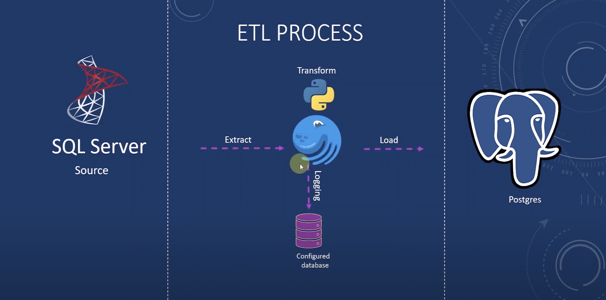

## What is Dagster?
    In a nutshell its a pipeline monitoring tool. 
    Dagster allows infrastructure engineers, data engineers and 
    data scientists to semalessly collaborate to process and produce the trusted, reliable data needed in today's world.

    In technical terms, its workflow orchestration tool. Its useful to build ETL processes.

   The diagram shows how to use Dagster to orchestrate an example
   pipeline. In the centre Dagster orchestrates the entire process. Source connector: SQL Server.  Destination Connector: postgresql. It can also be aws glue for scalability purposes.

   Dagster provides a dashboard to see time and success for each process.
   
## Hands On:
   dagster new-project etl
   Advantages:
   https://www.youtube.com/watch?v=oeshl0H1JcU