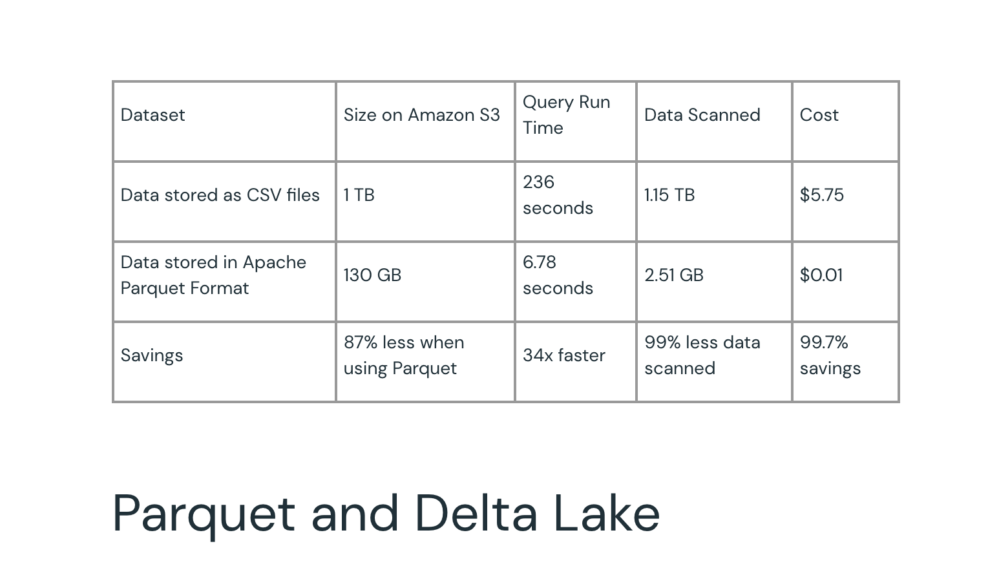
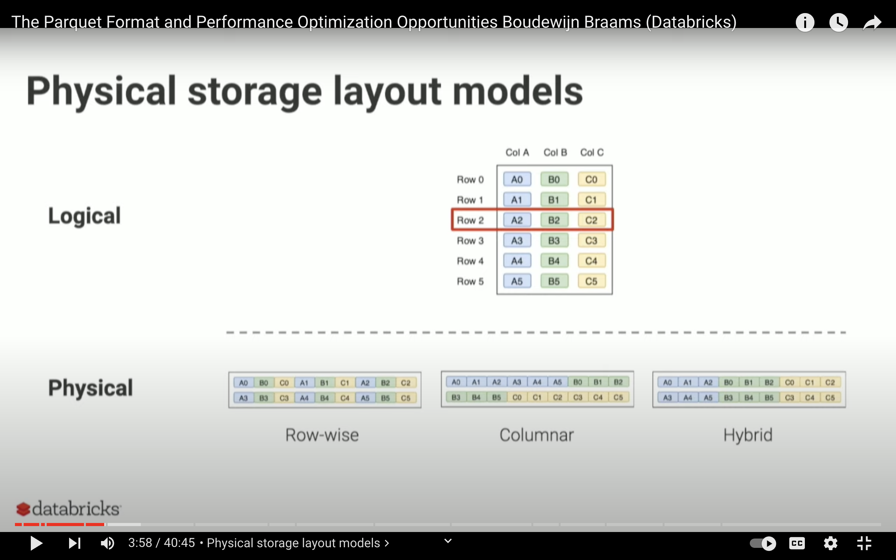

## Apache Parquet:
   Why Parquet? 
    Space Compression and increase in query (read and write speed).
    On the long run any company wants to have cost saving opportunities:

    
    At my previous company I transformed .csv files to Apache Parquet:
    with 99.7% in savings. 1TB stored files in csv on S3 is equivalent to
    150GB files saved on s3, query run time decreased from 236 sec to 6.78 sec
    read and write (34x faster) Per month: its 5.75 dollars to 0.01 dollars
    per month and 0.12 dollars over a year. 

## The Tech Behind Parquet and why its the new: DataLakehouse:
    Combining the speed of Data lakehouse and the ability to handle
    mix (structured, unstructured data) from Datawarehouse in 1.

   Apache Parquet provides a hybrid mapping between Tabular Data
   (rows and columns) to the logical data saved on disk. 
   Check the following reference from the image below:
   
   The row-wise provides a 1-1 mapping from logical to physical
   but I/O is expensive for table data operations. Columnar is 
   faster (eg. Postgresql) but lacks in terms of structure
   to do other operations like visualisation. So hybrid is preferred.
    
    Apache Parquet works best with s3 or severless (SQL query service)
    like: aws athena, Google BigQuery, etc...

    In python: apache parquet comes from the package pyarrow.

## References:
   * Parquet Data Organisation: https://www.youtube.com/watch?v=1j8SdS7s_NY
   * Parquet: https://www.databricks.com/glossary/what-is-parquet