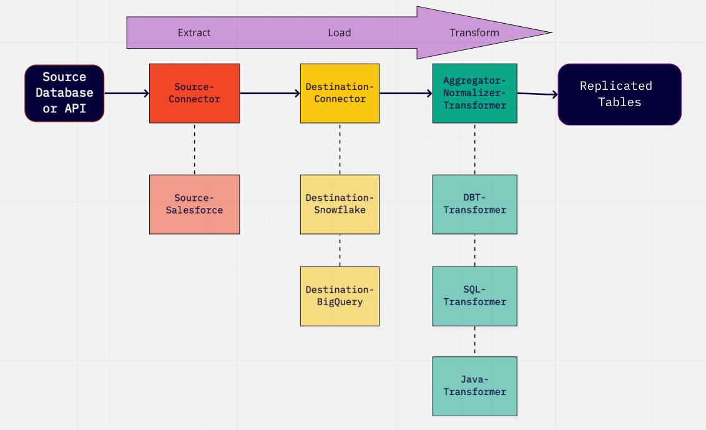

## Situation:
   Usually in Data Science and an ML Team in a Company we have
   different stakeholders: Data Science Team, Business Team requiring
   insights. Example situation at Jetblue. In the past 
   before using Airbyte and DBT engineers had to build new Data Models
   and then derive the insight.

   With Airbyte DBT and LLM in the future this will be an
   autonomous process.

   However we have data inconsistencies: Data Scientists mostly 
   use pandas, csv, json and other tabular data format for algorithmic,
   visualisation and business insights purposes. With DBT its
   easy to compile a new model and get transformed data for 
   the insights. The read and write operations are faster
   on MySQL, and other Apache Data. So a conversion is needed
   since sometimes data from source connectors have json blobs.
   They need to be "normalised" to Tables.

## Source:
   {
   "make": "alfa romeo",
   "model": "4C coupe",
   "horsepower": "247"
   }
   
   From Airbyte the destination connector will say:
   CREATE TABLE "_airbyte_raw_cars" (
   -- metadata added by airbyte
   "_airbyte_ab_id" VARCHAR, -- uuid value assigned by connectors to each row of the data written in the destination.
   "_airbyte_emitted_at" TIMESTAMP_WITH_TIMEZONE, -- time at which the record was emitted.
   "_airbyte_data" JSONB -- data stored as a Json Blob.
   );
   
   Then Basic Normalisation would normalise the JSONB file:
   CREATE TABLE "cars"(
   "_airbyte_ab_id" VARCHAR,
   "_airbyte_emitted_at" TIMESTAMP_WITH_TIMEZONE,
   "_airbyte_cars_hashid" VARCHAR,
   "_airbyte_normalized_at" TIMESTAMP_WITH_TIMEZONE,

   -- data from source
   "make" VARCHAR,
   "model" VARCHAR,
   "horsepower" INTEGER,
   );

   Example of how Normalisation works:

   Example 2 of Normalisation:
   Input of JSON from Source Connector:
   {
      "make": "alfa romeo",
      "model": "4C coupe",
      "limited_editions": [
      { "name": "4C spider", "release_year": 2013 },
      { "name" : "4C spider italia" , "release_year":  2018 }
      ]
   }
   
   The resulting normalized schema would be 2 
   since we have a nested JSON file:
   
   CREATE TABLE "cars" (
   "_airbyte_cars_hashid" VARCHAR,
   "_airbyte_emitted_at" TIMESTAMP_WITH_TIMEZONE,
   "_airbyte_normalized_at" TIMESTAMP_WITH_TIMEZONE,

    "make" VARCHAR,
    "model" VARCHAR
   );

   CREATE TABLE "limited_editions" (
   "_airbyte_limited_editions_hashid" VARCHAR,
   "_airbyte_cars_foreign_hashid" VARCHAR,
   "_airbyte_emitted_at" TIMESTAMP_WITH_TIMEZONE,
   "_airbyte_normalized_at" TIMESTAMP_WITH_TIMEZONE,
   
       "name" VARCHAR,
       "release_year" VARCHAR
   );

   Example 3:
   CREATE TABLE "cars" (
   "_airbyte_cars_hashid" VARCHAR,
   "_airbyte_emitted_at" TIMESTAMP_WITH_TIMEZONE,
   "_airbyte_normalized_at" TIMESTAMP_WITH_TIMEZONE,

    "make" VARCHAR,
    "model" VARCHAR
   );

   CREATE TABLE "cars_da3_cars" (
   "_airbyte_cars_hashid" VARCHAR,
   "_airbyte_cars_foreign_hashid" VARCHAR,
   "_airbyte_emitted_at" TIMESTAMP_WITH_TIMEZONE,
   "_airbyte_normalized_at" TIMESTAMP_WITH_TIMEZONE,
       "make" VARCHAR,
       "model" VARCHAR
   );   

## Reference: 
    https://docs.airbyte.com/understanding-airbyte/basic-normalization/
    
   
