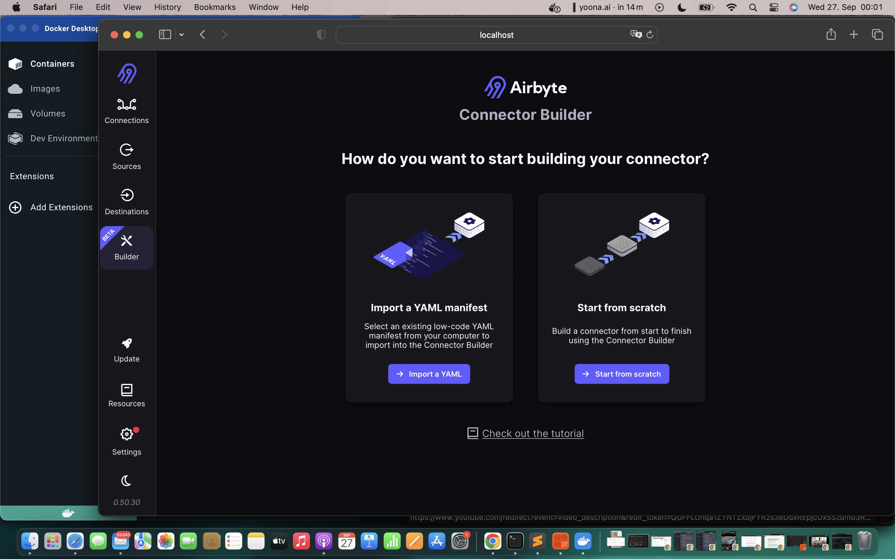

## Why is ETL important in LLM?
   Lots of data. As the number of frameworks available increase
   there is a problem that lots of connectors have to be written
   over and over again resulting in high engineering costs from teams.

   As cloud computing came over, the costs of scaling went drastically
   down and ETL was bound to exist. ETL provides (Extract data from source
   connector, Transform the Data carry over to the Destination Connector.)
  
    ETL vs ELT.
    ETL: Extract Transform Load
    Extract Load and then Transform (this one is more frequent since 
    its easier to transport the data to destination and transform
    based on the different teams or stakeholders needs: example:
    Business intelligence, Data Visualisation Tool.

    ELT defacto: really good tool
       * Extract from Source Connector
         Load - Databases: Supabase, posgresql
                Datawarehouses: eg. Snowflake (holds data ready for consumption)
                DataLakes: eg. s3 Buckets (holds all structured types)
    
         * Transform - dbT (write sql models on top of the data)
       
       * Goal: Derive Insights to help better sales.     

s
## Goal:
   With all those Data then you can derive insights: 

## Example of ELT System
   API from the Frontend pulls from a source eg. Salesforce or JSON, Notion and move 
   to our destination (S3 or Snowflake as Datawarehouse). 
   Option 1: You could have the scripts written manually in python to do so. but over the years
   the cost of compute has been significantly decreased such that it makes sense to go for option 2.
    
   Option 2: ELT Tool

   Sales (Input) Connector --> Airbyte --> Snowflake Connector processed by dBT.

## ETL vs ELT System
   * ETL eg. : Salesforce --> Script for Transform --> Snowflake.
   * Advantages of ETL vs ELT --> In the case your raw Data is needed by several Stakeholders
     like Business Team, Advertising Team or other teams. You can in theory move all the information
     to destination source and finally transform it individually for different teams. (Transfer and sync once)

## Example Project: 
    Low Key CDK for the connectors and how to test the connectors before setting into production.
    https://www.youtube.com/watch?v=LQ2RqsrxIRc 

## Why airbyte?
   A lot of other tools and sources are paid per data or stream. Airbyte is free and cover most of 
   the usecases. You pay only if you dont want to pay to configure for the connectors manually.
   The airbyte CDK is good for that.

## References:
   https://www.youtube.com/watch?v=oeshl0H1JcU

## Getting Started
   https://github.com/airbytehq/airbyte/tree/master
   
## Custom Connector
    How and why before?

## Airbyte under the Hood:
   For each Data Source you have: airbyte connector has to be setup. 
   Example:

## Airbyte CDk

## No Code API Connectors or Low Code CDK:
   * https://docs.airbyte.com/connector-development/connector-builder-ui/tutorial
   * No Code Builder: https://www.youtube.com/watch?v=g_NZPHVNB38

      Example building an API to Ingest Data from Platfrom Seatgeek.com
      http://platform.seatgeek.com/

      Always 2 things are needed: Base Url which almost all endpoints provide +
      endpoint entry and authentication key.
      Its a good idea to test your endpoint using Postman.
      Terminologies: A stream in Airbyte is an endpoint 

      now a company or enterprise makes several endpoints available 

      The advantage of the new Airbyte connector is you can test the endpoints
      right on the terminal. Previously I used to test on Postman or those kinds of tools.

      The other advantage is the record selector. 

      The advantage is also: the incremental sync for large data. You could have written the entire code to filter the data by hand but airbyte helps you with that. Incremental Sync has data filters. 
      Some of them have sorting options given by the api endpoint from which
      we are injesting data.

      Now we could build custom Data endpoints on Django or so to get the filters done or use Airbyte with robust connectors.

      In terms of testing we can do multiple calls of the api endpoints here: 
      Nested Calls one query feeds into the other one.      
      Case: 
         - Seatgeek: 
            - Secret: e37569bd5f4aa77fd499847a6416e75ca4fb167da115feaeea6bde5a4d8aea4a

            - Client_ID: 
            MzcwMTY3Mjl8MTY5NTc5NzkxMS45MDA0MTk 

      Other Things with 
   
   * Case 2: 
     * Why airbyte? Production ready connectors and UI + scaling advantages.
     * Airbyte with LLM: check and apply the tutorial needed.
     * Example

## Combination with Dagster:
   

## DBT for the Transformation of the Tables:
   * Normalisation: why? Normalisation? 
     - In the scenario of having a source connector with tables and sending to 
       a destination connector. Sometimes in the tables some raws might contain
       some json blob. The process of expanding those json parts is called Normalisation.
       aka. making the data normal under the schema: "header", "single data entry".
   * The other unfair advantage of Airbyte is the fact that DBT is used internally
     to adapt the SQL Dialects to the destination queries. (e.g Big Query has different sql dialect than snowflake.)
    
     The following will explain the example of Normalisation:
     
     Let's assume we have the output from an api:
     From source api:
     {
     "make": "alfa romeo",
     "model": "4C coupe",
     "horsepower": "247"
     }
     
     The data output will be in json format. And the table created for Posgresql or other things will be like:
     
    CREATE TABLE "_airbyte_raw_cars" (
     -- metadata added by airbyte
     "_airbyte_ab_id" VARCHAR, -- uuid value assigned by connectors to each row of the data written in the destination.
     "_airbyte_emitted_at" TIMESTAMP_WITH_TIMEZONE, -- time at which the record was emitted.
     "_airbyte_data" JSONB -- data stored as a Json Blob.
     );
    
     Then a basic normalization would create the following table:
     CREATE TABLE "cars" (
    "_airbyte_ab_id" VARCHAR,
    "_airbyte_emitted_at" TIMESTAMP_WITH_TIMEZONE,
    "_airbyte_cars_hashid" VARCHAR,
    "_airbyte_normalized_at" TIMESTAMP_WITH_TIMEZONE,

    -- data from source
    "make" VARCHAR,
    "model" VARCHAR,
    "horsepower" INTEGER
    );
    
    CREATE TABLE "cars" (
    "_airbyte_ab_id" VARCHAR,
    "_airbyte_emitted_at" TIMESTAMP_WITH_TIMEZONE,
    "_airbyte_cars_hashid" VARCHAR,
    "_airbyte_normalized_at" TIMESTAMP_WITH_TIMEZONE,

    -- data from source
    "make" VARCHAR,
    "model" VARCHAR,
    "horsepower" INTEGER
    );
           
    Example 2: Nested Objects:
    {
        "make": "alfa romeo",
        "model": "4c coupe",
        "powertrain_specs":{"horsepower":247,"transmission": "6-speed"}
    }

    After normalisation we have:
    CREATE TABLE "cars" (
    "_airbyte_cars_hashid" VARCHAR,
    "_airbyte_emitted_at" TIMESTAMP_WITH_TIMEZONE,
    "_airbyte_normalized_at" TIMESTAMP_WITH_TIMEZONE,

    "make" VARCHAR,
    "model" VARCHAR
    );
    
    CREATE TABLE "powertrain_specs" (
    "_airbyte_powertrain_hashid" VARCHAR,
    "_airbyte_cars_foreign_hashid" VARCHAR,
    "_airbyte_emitted_at" TIMESTAMP_WITH_TIMEZONE,
    "_airbyte_normalized_at" TIMESTAMP_WITH_TIMEZONE,
    
        "horsepower" INTEGER,
        "transmission" VARCHAR
    );

   There are some metadata columns that are produced and transferred 
   from destination core to the end table.
    
    Why normalisation? Well, simply because the Business Analytics 
    team and visualisation team need visualisations from libraries like:
    Tableau, Metabase and these work primarily using Pandas Dataframe, Apache
    Parquet files, column data.
    
    Thats the result why we chose 
    
   * Deduping and why:
   * https://www.youtube.com/watch?v=I4fngMnkJzY&t=184s

## DBT
   * Example Tutorial on DBT

## References:
   * https://github.com/airbytehq/airbyte/blob/master/docs/understanding-airbyte/basic-normalization.md#Rules
   * https://docs.airbyte.com/understanding-airbyte/basic-normalization/